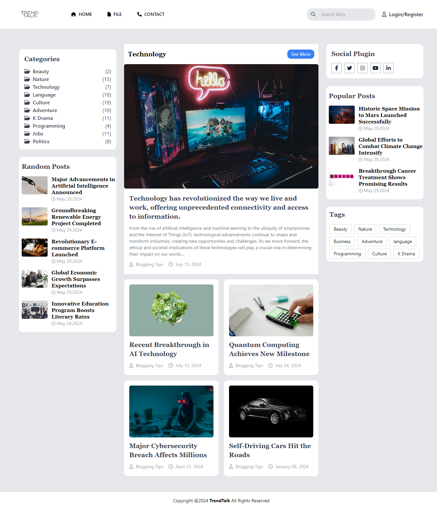
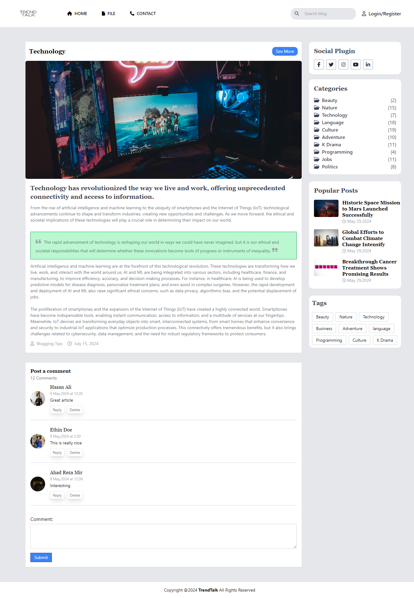

## TrendTalk: A Modern Blog Template Built with Tailwind CSS
TrendTalk is a sleek and modern blog template designed to help you share your thoughts, ideas, and stories with the world. Built using Tailwind CSS, this template offers a highly customizable and responsive design that adapts to any device or screen size.

## Features:
- Clean and minimalistic design with a focus on readability
- Fully responsive layout that works seamlessly on desktop, tablet, and mobile devices
- Customizable color scheme and typography using Tailwind CSS utility classes
- Modular design with reusable components for easy maintenance and updates
- Supports popular blog features such as categories, tags, and search functionality
- Easy to integrate with your favorite blogging platform or CMS
- 
## Why use TrendTalk?
- Get started with a professional-looking blog in no time
- Focus on writing great content while we handle the design and layout
- Easily customize the template to fit your personal brand and style
- Take advantage of Tailwind CSS's powerful utility classes to speed up your development process

## Screenshot

## Getting Started:
- Clone or download the repository
- Install the necessary dependencies using npm install or yarn install
- Customize the template to fit your needs using Tailwind CSS utility classes
- Integrate with your favorite blogging platform or CMS
- Start writing and sharing your amazing content with the world!

## License:
TrendTalk is licensed under the MIT License, which means you can use, modify, and distribute the template freely for personal or commercial purposes.

## Contributing:
If you'd like to contribute to TrendTalk, please fork the repository and submit a pull request with your changes. We'd love to see how you customize and extend the template!

## Issues:
If you encounter any issues or have questions about the template, please open an issue in the repository and we'll do our best to help you out.

